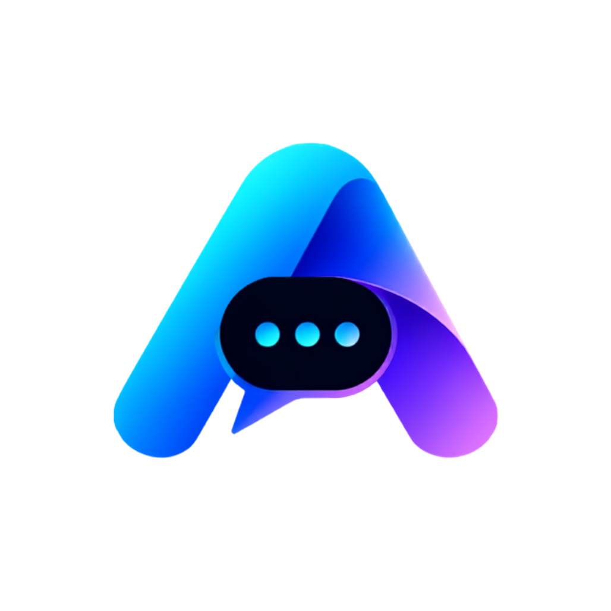
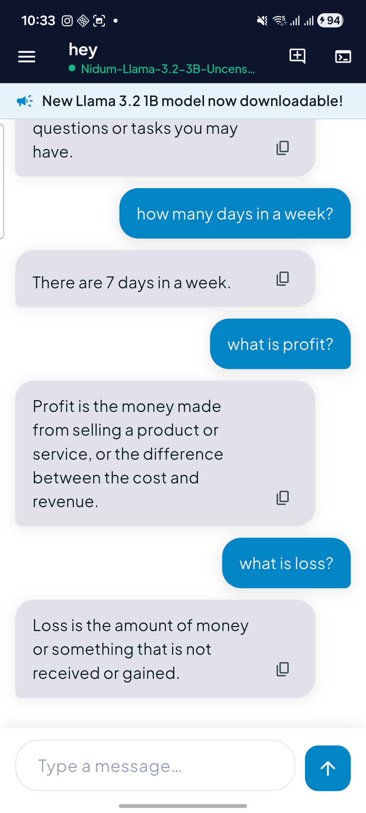
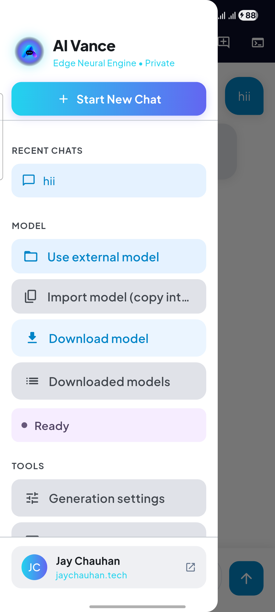
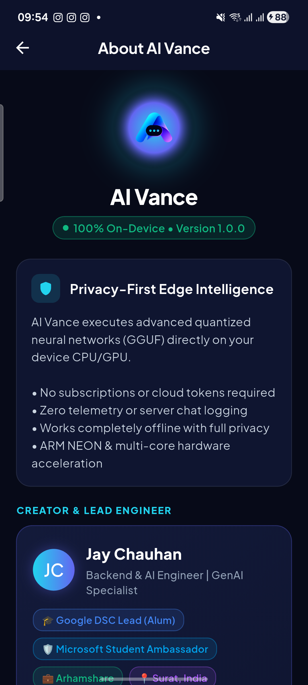

# AI Vance

<p align="center">
  
</p>

<p align="center">
  <strong>100% Offline, Private & On-Device AI Assistant for Android</strong><br>
  Run quantized GGUF neural models natively on device hardware with zero cloud dependencies.
</p>

<p align="center">
  
  
  
  
  
</p>

---

## Overview

**AI Vance** (`com.jaychauhan.aivance`) is a modern, privacy-first Android application that executes generative AI models directly on your smartphone hardware. With zero telemetry, zero server inference, and full offline execution, your conversations and data never leave your device.

By leveraging quantized GGUF architectures through native C++ bindings, AI Vance delivers fast, streaming AI responses without requiring an internet connection.

---

## App Showcase

<p align="center">
  
  &nbsp;&nbsp;
  
  &nbsp;&nbsp;
  
</p>

---

## Core Capabilities

- 🔒 **Zero Data Transmission**: All inference runs locally on the device CPU/GPU. No prompt, token, or chat history is ever transmitted over the network.
- ⚡ **GGUF Model Execution**: Direct support for quantized GGUF models (Llama 3, Gemma, Mistral, ChatML, Qwen, Phi).
- 🌊 **Real-Time Token Streaming**: Fluid word-by-word streaming generation with automatic fallback mechanisms.
- 📥 **Integrated Model Hub**: One-tap downloads for curated lightweight LLMs with resume support and progress tracking.
- 🎛️ **Granular Parameter Control**: Adjust context size, temperature, Top-P, Top-K, maximum tokens, and repetition penalty on the fly.
- 🗂️ **Local Chat Management**: Organize, rename, switch, and delete multi-turn conversations stored securely in local device storage.
- 🛠️ **In-App Developer Console**: Built-in terminal capturing real-time device logs, memory statistics, and runtime diagnostics.
- 📡 **Enterprise Remote Config**: Dynamic version enforcement, scheduled maintenance notices, and broadcast alerts via Firebase Remote Config.

---

## Architecture & Tech Stack

```text
AI Vance Architecture
├── Presentation Layer     Flutter Material 3, Google Fonts, Riverpod State
├── Inference Engine       llama.cpp via native Flutter platform channels
├── Storage & I/O          Scoped Storage, Document Providers, SharedPreferences
├── Remote Orchestration   Firebase Remote Config (Version control & alerts)
└── Native Android         Kotlin 1.9+, Android SDK 35/36, CMake C++20
```

- **Framework**: Flutter 3.x / Dart 3.x
- **State Management**: Riverpod (`flutter_riverpod`)
- **Native Inference**: `llama.cpp` C++ engine bindings
- **Storage**: `path_provider`, `permission_handler`, `file_picker`
- **Cloud Config**: Firebase Core & Remote Config

---

## Quick Start Guide

### Prerequisites

- Flutter SDK (stable channel)
- Android Studio / Android SDK (API Level 24+)
- Physical Android device with 6GB+ RAM recommended for running 1B–3B parameter LLMs

### Installation & Run

```bash
# Clone the repository
git clone https://github.com/Jay3Chauhan/ai-vance.git
cd ai-vance

# Install Flutter dependencies
flutter pub get

# Launch on connected Android device
flutter run --release
```

---

## Model Compatibility & Storage

1. **Pick Custom Models**: Select any valid `.gguf` file stored on internal or SD storage.
2. **Download Curated Models**: Download tested compact models directly within the app:
   - Download destination: `/storage/emulated/0/AIVance/`
3. **RAM Recommendations**:
   - **0.5B – 1.5B Models**: Requires ~2 GB to 3 GB available RAM
   - **3B Models**: Requires ~4 GB to 6 GB available RAM
   - **7B Models**: Requires 8 GB+ available RAM

---

## Documentation & Store Release Guides

All enterprise deployment guides and release specifications are located in [`docs/`](docs/):

| Guide | Description |
|---|---|
| [**Play Store Release Guide**](docs/PLAYSTORE_GUIDE.md) | Step-by-step console setup, bundle signing, Data Safety answers, and All Files Access declarations. |
| [**Keystore Credentials**](docs/KEYSTORE_CREDENTIALS.md) | Keystore path, alias, passwords, and SHA-1/SHA-256 certificate fingerprints. |
| [**Firebase Remote Config**](docs/FIREBASE_GUIDE.md) | Dynamic version management, Force Update flags, and Maintenance Mode implementation. |
| [**Privacy Policy**](docs/PRIVACY_POLICY.md) | Official 100% on-device privacy declaration. |

---

## Author

**Jay Chauhan**  
- Website: [jaychauhan.tech](https://jaychauhan.tech)  
- GitHub: [@Jay3Chauhan](https://github.com/Jay3Chauhan)  
- LinkedIn: [in/jay-chauhan-5a65921ba](https://linkedin.com/in/jay-chauhan-5a65921ba)  
- Email: [contact@jaychauhan.tech](mailto:contact@jaychauhan.tech)

---

## License

This project is licensed under the **GNU General Public License v3.0** — see the [LICENSE](LICENSE) file for details.